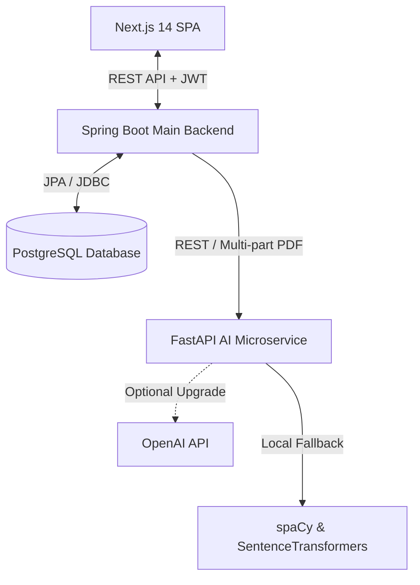

# AI-Powered Resume Screening & Hiring Dashboard

An MVP of a modern, production-ready SaaS application designed for recruiters to automate candidate screening using Natural Language Processing (NLP) and semantic search. Recruiters can post jobs, upload resumes in PDF format, parse structured candidate profiles, compute semantic compatibility scores, and view analysis details on a responsive dashboard.

---

## 🏗️ System Architecture



- **Frontend Gateway**: Built with **Next.js 14** (App Router) using Tailwind CSS and shadcn/ui for a premium glassmorphic theme. Communicates with the Spring Boot backend using Axios with interceptors for JWT token propagation.
- **Main Backend (Orchestrator)**: Built with **Spring Boot 3**, managing JPA database models, repositories, business logic, file storage, and Spring Security with stateless JWT authorization.
- **AI Microservice**: Built with **FastAPI** (Python), running spaCy Named Entity Recognition (NER), PyMuPDF text extraction, and SentenceTransformers (`all-MiniLM-L6-v2`) for semantic embeddings. It automatically upgrades to GPT models for summaries if an `OPENAI_API_KEY` is present.

---

## 🛠️ Technology Stack

### Frontend
- **Framework**: Next.js 14 (App Router)
- **Language**: TypeScript
- **Styling**: Tailwind CSS, shadcn/ui, Lucide Icons
- **Data Fetching**: Axios, React Query (TanStack Query)
- **Charts**: Recharts

### Backend
- **Framework**: Spring Boot 3
- **Database**: PostgreSQL
- **Security**: Spring Security (Stateless JWT token authentication)
- **ORM**: Spring Data JPA / Hibernate

### AI Microservice
- **Framework**: FastAPI
- **Text Extraction**: PyMuPDF (`fitz`)
- **NLP**: spaCy (Custom skills rules and NER)
- **Embeddings**: SentenceTransformers (`all-MiniLM-L6-v2`)
- **LLM Integration**: OpenAI API (Optional wrapper for summaries)

---

## 🚀 Getting Started

### Prerequisites
- **Java**: JDK 17
- **Python**: 3.10+
- **Node.js**: v18+
- **Database**: PostgreSQL 14+ or Docker installed

---

### 1. Setup AI Microservice (`ai-service/`)

1. Navigate to the folder:
   ```bash
   cd ai-service
   ```
2. Create and activate a Python virtual environment:
   ```bash
   python -m venv venv
   # On Windows
   .\venv\Scripts\activate
   # On macOS/Linux
   source venv/bin/activate
   ```
3. Install dependencies:
   ```bash
   pip install -r requirements.txt
   ```
4. Download spaCy English language model:
   ```bash
   python -m spacy download en_core_web_sm
   ```
5. *(Optional)* Set your OpenAI API key:
   ```bash
   # On Windows (PowerShell)
   $env:OPENAI_API_KEY="your-api-key"
   # On macOS/Linux
   export OPENAI_API_KEY="your-api-key"
   ```
6. Start the server:
   ```bash
   python main.py
   ```
   *The server runs by default on `http://localhost:8000`.*

---

### 2. Setup Spring Boot Backend (`backend-spring/`)

1. Navigate to the folder:
   ```bash
   cd backend-spring
   ```
2. Configure PostgreSQL properties in `src/main/resources/application.yml` or set environment variables:
   - `DB_HOST` (Default: `localhost`)
   - `DB_PORT` (Default: `5432`)
   - `DB_NAME` (Default: `resume_screener`)
   - `DB_USER` (Default: `postgres`)
   - `DB_PASS` (Default: `postgres`)
3. Compile and build:
   ```bash
   mvn clean compile package
   ```
4. Start the application:
   ```bash
   mvn spring-boot:run
   ```
   *The backend runs by default on `http://localhost:8888`.*
   *Note: On startup, the database is auto-seeded with a recruiter account (`recruiter@example.com` / `password`), sample jobs, candidates, and applications for a complete demo experience.*

---

### 3. Setup Next.js Frontend (`frontend-next/`)

1. Navigate to the folder:
   ```bash
   cd frontend-next
   ```
2. Install packages:
   ```bash
   npm install
   ```
3. Configure environment variables in `.env.local`:
   ```env
   NEXT_PUBLIC_API_URL=http://localhost:8888
   ```
4. Start the development server:
   ```bash
   npm run dev
   ```
   *The frontend runs by default on `http://localhost:3000`.*

---

## 🐳 Docker Orchestration

You can build and spin up the complete infrastructure (PostgreSQL database, FastAPI engine, Spring Boot API, and Next.js UI) containerized using:

```bash
docker-compose up --build
```

---

## 🔒 Security & Roles

- **Stateless Authorization**: All endpoints under `/jobs/**`, `/candidates/**`, `/applications/**`, and `/analytics/**` require a bearer JWT token in the `Authorization` header.
- **Roles**: Default recruiter user is assigned `ROLE_RECRUITER` role.
